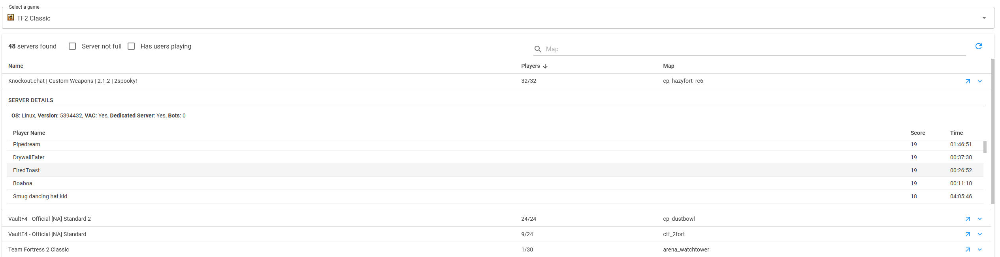

## Universal Steam Server Browser WebApp
Primarily used for Source & GoldSrc games/mods!

### How to run
Edit SteamAPIKey in 'GameServerList.App/appsettings.json', then launch app.sln, compile and launch from there.

### Adding new game entries
Edit the 'GameServerList.App/Data/games.json' file.

### CI

### Preview

